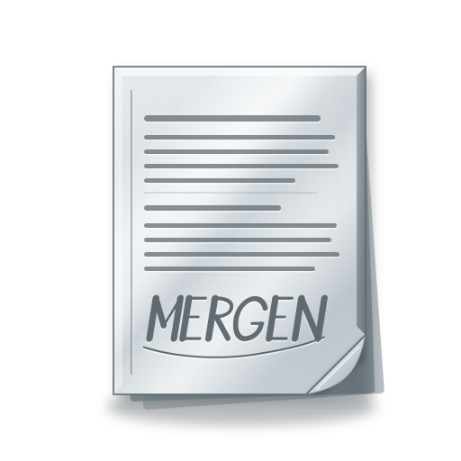

<p align="center" width="100%">
    
</p>

<h1 align="center">MERGEN</h1>
<p align="center"><strong>A minimal PDF viewer for Arch Linux and Debian</strong></p>

<p align="center">
  
  
</p>

<p align="center">
  
  
  
  
</p>

---

## 1. DESCRIPTION

MERGEN opens PDFs on Arch Linux and Wayland — reads them continuously, zooms and rotates them, searches them, selects text from them, and prints them — and refuses everything else on purpose. It has no update check, no telemetry, no form filling, no signatures, no tabs, no settings, no themes. The two colours on your screen come from your system palette, not from the application deciding for you. The refusal is the selling point.

**What it does:**

- Opens PDFs with continuous scrolling and smooth motion
- A scrolling strip of page previews down the side (`Ctrl+B` to hide it)
- Zoom in/out, fit to width, fit to page, rotate
- Two pointer modes: select text, or grab the page and move it in any direction
- Text selection and copy to clipboard
- Full-document search with live navigation
- Table of contents overlay (dismissed with `Esc`)
- Command palette (`Ctrl+K`) — jump to a page, search, or run any action
- Night mode that inverts lightness while keeping colours true (a red chart stays red)
- Presentation mode (fullscreen, one page at a time, `F5` to enter, `Esc` to leave)
- Compare two PDF revisions side by side with differences marked
- Portals — reader-made two-way links between locations in one document or across two
- Printing with page ranges, including from password-protected documents
- Watch a file and reload when it changes on disk
- Open root-owned files by requesting elevation through `polkit`
- Control from a Unix socket, so a tiling-WM keybinding can drive it
- A status bar showing the file's full path, its dates, and its permissions

Written in C++20 with Qt6 and poppler. No KDE Frameworks, no desktop-environment dependencies.

---

## 2. INSTALLATION

### Arch Linux

Download `mergen-2.0.6-1-x86_64.pkg.tar.zst` from the Releases page:

```sh
sudo pacman -U mergen-2.0.6-1-x86_64.pkg.tar.zst
```

Or build from source:

```sh
git clone https://github.com/sudo-megas/MERGEN.git
cd MERGEN/packaging
makepkg -si
```

### Debian

Debian 13 (trixie) or newer. MERGEN needs Qt 6.5 and Debian 12 carries 6.4, so
bookworm cannot build or run it.

Download `mergen_2.0.6-1_amd64.deb` from the Releases page:

```sh
sudo apt install ./mergen_2.0.6-1_amd64.deb
```

`apt` rather than `dpkg -i`, so the Qt and poppler libraries it needs are
brought in with it.

One difference from the Arch package is worth knowing before you wonder what
broke. The toolbar's icons are glyphs from the Nerd Font patch of Cascadia
Code, and Debian does not carry that patch — only the unpatched
`fonts-cascadia-code`, which the package recommends and which supplies the
interface font. Without the patched build MERGEN labels its toolbar buttons
with text rather than drawing a row of tofu boxes. Everything works; it reads
differently. Installing [CaskaydiaCove Nerd
Font](https://github.com/ryanoasis/nerd-fonts) by hand restores the icons.

Or build the package from source, which is exactly what CI does:

```sh
git clone https://github.com/sudo-megas/MERGEN.git
cd MERGEN
sudo apt install devscripts equivs
sudo mk-build-deps --install --remove packaging/debian/control
./scripts/build-deb.sh
sudo apt install ./dist/mergen_*.deb
```

---

## 3. BASIC USE

Open a PDF by clicking it in your file manager, passing it on the command line, or with `Ctrl+O` inside MERGEN.

Navigate with arrow keys, `Page Up`/`Page Down`, `Home`/`End`. Multiple PDFs open in separate windows — one document per window, one window per document.

### Keyboard

| Key | Does |
|---|---|
| `Ctrl+O` | Open a file |
| `Ctrl+K` | Command overlay — jump to a page by number, search, or run an action by name |
| `Ctrl+T` | Table of contents overlay |
| `Ctrl+F` | Search in the document |
| `Ctrl+I` | Document properties — version, fonts, permissions, warnings |
| `Ctrl+N` | Night mode on / off |
| `Ctrl+P` | Print |
| `Ctrl+D` | Compare with another document / leave comparison |
| `Ctrl+M` | Mark one end of a portal, or complete it |
| `Ctrl+J` | Follow the portal on this page |
| `F` | Fit to width |
| `Shift+F` | Fit to page |
| `R` | Rotate 90° clockwise |
| `Ctrl+B` | Page previews on / off |
| `Ctrl+H` | Switch between selecting text and moving the page |
| `F5` | Presentation mode |
| `Esc` | Close the frontmost overlay, or leave presentation mode |

Hold the pointer over an internal link and MERGEN shows its target without navigating. Release to dismiss.

### Make it your default PDF reader

```bash
xdg-mime default mergen.desktop application/pdf
```

---

## 4. WHAT IT REFUSES

MERGEN has no form filling, no digital signatures, no bookmarks, no tabs, no multi-document workspace. It will not remember which page you were on, will not update itself, will not phone home, will not collect your data or your habits. It has no tray icon and no menu bar.

Every refusal is stated rather than hidden. If a PDF has embedded JavaScript or forms or attachments, MERGEN tells you so. If it cannot open a file, it shows you why. The goal is clarity, not pretence.

---

## 5. LICENCE SUMMARY

MERGEN is free software under the **GNU General Public License, version 3 only** (`GPL-3.0-only`).

In plain terms: you may use it for anything, study how it works, share it with anyone, and change it to suit yourself. If you distribute a changed version, it must carry this same licence. It comes with **no warranty**.

The full text is in the [`LICENSE`](LICENSE) file in this repository and is readable inside the application from the toolbar.

---

Copyright © sudo-megas · <https://github.com/sudo-megas/MERGEN>

*Built with Reason and Passion.*
